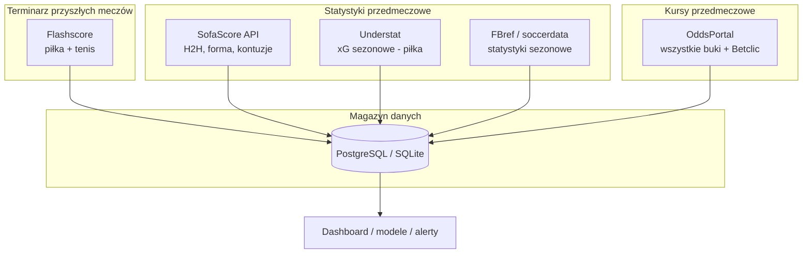

# Plan i analiza: statystyki przyszłych meczów + kursy (piłka nożna i tenis)

> Dokument planistyczny — system zbierania danych bez płatnych API sportowych.  
> Silnik: **Scrapling** (repozytorium `/workspace`).  
> Data: 2026-07-09

---

## Werdykt

**Da się zbudować cały system bez płatnych API sportowych**, opierając się na scrapingu i darmowych źródłach. W repozytorium jest już **Scrapling** — odpowiedni silnik pod to zadanie.

Kluczowe ograniczenie, które trzeba zaakceptować na starcie:

> Dla **przyszłych** meczów nie ma jeszcze statystyk z samego spotkania (strzały, xG meczu, posiadanie).  
> Można zebrać **wszystko, co jest dostępne przed meczem**: forma, H2H, statystyki sezonowe, rankingi, kontuzje, nawierzchnia (tenis) oraz **kursy przedmeczowe ze snapshotami**.

---

## Co dokładnie oznacza „wszystkie statystyki przyszłych meczów”

### Piłka nożna — dostępne PRZED meczem

| Kategoria | Przykładowe dane | Źródło |
|---|---|---|
| Terminarz | data, liga, drużyny, ID meczu | Flashscore, SofaScore |
| Forma | ostatnie 5–10 meczów (W/D/L, gole) | SofaScore, FBref |
| Statystyki sezonowe | gole, xG, xGA, strzały/mecz, clean sheets | Understat, FBref |
| H2H | historia spotkań, wyniki, xG | SofaScore, Understat |
| Tabela | pozycja, punkty, bilans dom/wyjazd | Flashscore |
| Kontuzje / absencje | lista niedostępnych | SofaScore |
| Składy | przewidywane / potwierdzone (2–24 h przed) | SofaScore |
| Kontekst | trener, derby, faza pucharu | metadane z terminarza |

### Tenis — dostępne PRZED meczem

| Kategoria | Przykładowe dane | Źródło |
|---|---|---|
| Terminarz | turniej, runda, zawodnicy, nawierzchnia | Flashscore |
| Ranking | ATP/WTA, punkty | Flashscore, SofaScore |
| Forma | ostatnie mecze, bilans sezonu | SofaScore |
| H2H | historia bezpośrednich spotkań | SofaScore |
| Statystyki nawierzchni | % wygranych na hard/clay/grass | SofaScore |
| Serwis / return | % 1. serwisu, break points (sezon) | SofaScore |
| Kontekst turnieju | zmęczenie (mecze w turnieju), czas odpoczynku | obliczane z terminarza |

### Czego NIE będzie przed meczem (dopiero po zakończeniu)

- xG konkretnego meczu (piłka)
- mapa strzałów
- statystyki live (posiadanie, rożne w tym meczu)
- wynik setów / gemów (tenis)

---

## Kursy — strategia „z drugiej ręki”

Bezpośredni scraping Betclic to najtrudniejsza ścieżka. **Agregatory są lepsze:**

| Źródło | Piłka | Tenis | Betclic | Dostępność |
|---|---|---|---|---|
| **OddsPortal** | Tak | Tak | Tak (PL/FR) | Dobra (HTTP 200) |
| **OddsHarvester** (OSS) | Tak | Tak | Filtr bukmachera | Playwright |
| football-data.co.uk | Tak | Nie | Nie | CSV, darmowe |
| Betclic bezpośrednio | Tak | Tak | Tak | 403 / WAF |

**Rekomendacja:** OddsPortal jako główne źródło kursów + filtr `Betclic PL` (i inne buki opcjonalnie).

### Rynki kursów do zebrania

**Piłka nożna:**

- 1X2 (match result)
- Over/Under (np. 2.5)
- Asian Handicap
- Double Chance, BTTS (opcjonalnie)

**Tenis:**

- Zwycięzca meczu (moneyline)
- Over/Under setów
- Over/Under gemów
- Handicap setów/gemów
- Correct score (opcjonalnie)

---

## Mapa źródeł danych



### Dlaczego te źródła

| Źródło | Rola | Koszt | Trudność |
|---|---|---|---|
| **Flashscore** | Master terminarz (piłka + tenis) | 0 zł | Średnia — wewnętrzne API |
| **SofaScore** | Statystyki, H2H, kontuzje, rankingi | 0 zł | Średnia — TLS fingerprint (Scrapling/curl_cffi) |
| **Understat** | xG piłkarskie (forma ofensywna) | 0 zł | Łatwa — JSON w HTML |
| **OddsPortal** | Kursy wszystkich buków | 0 zł | Średnia–wysoka — JS + szyfrowanie feedów |
| **football-data.co.uk** | Historia do backtestingu | 0 zł | Bardzo łatwa — gotowe CSV |

---

## Architektura systemu

### Model danych (rdzeń)

```
events                    # każdy przyszły mecz
├── id, sport, league, start_time
├── home_participant, away_participant
├── status (scheduled / live / finished)
└── external_ids {flashscore, sofascore, oddsportal}

event_stats_prematch      # statystyki PRZED meczem
├── event_id
├── scraped_at
├── home_form_last5, away_form_last5
├── h2h (JSON)
├── home_season_xg, away_season_xg     # piłka
├── home_ranking, away_ranking         # tenis
├── surface_win_pct                    # tenis
├── injuries (JSON)
└── raw_payload (JSON backup)

odds_snapshots            # kursy w czasie
├── event_id
├── bookmaker (betclic_pl, bet365, ...)
├── market (1x2, ou_2_5, match_winner, ...)
├── selection, odds_decimal
├── scraped_at
└── is_opening / is_closing
```

### Pipeline — 4 joby cykliczne

| Job | Częstotliwość | Co robi |
|---|---|---|
| **fixtures_sync** | co 2–4 h | Pobiera wszystkie przyszłe mecze piłki + tenisa |
| **stats_enrich** | co 6–12 h | Dla każdego przyszłego meczu: forma, H2H, xG, rankingi |
| **odds_snapshot** | co 30–60 min | Kursy przedmeczowe ze wszystkich buków |
| **pre_match_boost** | 2 h przed startem | Składy, ostatnie kontuzje, finalne kursy |

### Stack techniczny (na bazie Scrapling)

```
Scrapling (repo /workspace)
├── Fetcher / StealthyFetcher     → Understat, OddsPortal HTML
├── curl_cffi (TLS fingerprint)   → SofaScore API, Flashscore API
├── Spider framework              → crawl lig i turniejów
└── adaptive selectors            → odporność na zmiany DOM

Storage: PostgreSQL (prod) lub SQLite (MVP)
Scheduler: cron / APScheduler
Output: REST API lub eksport CSV/JSON
```

---

## Plan implementacji — 4 fazy

### Faza 0 — Fundament (MVP terminowy)

**Cel:** lista wszystkich przyszłych meczów piłki i tenisa.

| Zadanie | Szczegóły |
|---|---|
| Spider Flashscore | Piłka: top ligi (PL, ENG, ESP, ITA, GER, FR, UCL) + Ekstraklasa |
| Spider Flashscore | Tenis: ATP, WTA, Challenger (najbliższe 7 dni) |
| Baza danych | Tabela `events` z deduplikacją |
| Eksport | JSON/CSV z listą meczów |

**Deliverable:** „Kalendarz przyszłych meczów” — piłka + tenis, odświeżany co 4 h.

---

### Faza 1 — Statystyki przedmeczowe

**Cel:** dla każdego przyszłego meczu — pełny pakiet statystyk dostępnych przed startem.

| Sport | Co zbieramy | Źródło |
|---|---|---|
| Piłka | forma, H2H, xG sezonowe, kontuzje | SofaScore + Understat |
| Tenis | ranking, H2H, forma, statystyki nawierzchni | SofaScore |
| Oba | dopasowanie uczestników między źródłami | fuzzy matching nazw |

**Deliverable:** dla każdego meczu z Fazy 0 — JSON ze statystykami przedmeczowymi.

**Ryzyko:** dopasowanie nazw drużyn/zawodników między Flashscore ↔ SofaScore (np. „Man Utd” vs „Manchester United”). Wymaga słownika aliasów.

---

### Faza 2 — Kursy przedmeczowe

**Cel:** snapshoty kursów ze wszystkich buków (w tym Betclic PL).

| Zadanie | Szczegóły |
|---|---|
| Integracja OddsPortal | Spider na bazie Scrapling StealthyFetcher |
| Mapowanie bukmacherów | ID Betclic PL z `bookies-{timestamp}.js` |
| Rynki piłkarskie | 1X2, O/U 2.5, AH |
| Rynki tenisowe | match winner, O/U setów, O/U gemów |
| Historia kursów | snapshot co 30–60 min → wykrywanie ruchu linii |

**Alternatywa gotowa:** [OddsHarvester](https://github.com/jordantete/OddsHarvester) (OSS, Playwright) — obsługuje piłkę i tenis, eksport CSV/JSON, filtr bukmachera.

**Deliverable:** tabela `odds_snapshots` z historią kursów per mecz per buk.

#### OddsPortal — znane endpointy (community)

```
1. Mapa bukmacherów:
   https://www.oddsportal.com/res/x/bookies-{timestamp}.js
   → JSON z ID bukmachera (np. Betclic PL)

2. Kursy meczu:
   https://fb.oddsportal.com/feed/match/{version}-{sport}-{matchId}-...
   → kursy per buk, historia ruchu linii
```

**Uwaga:** Od ~2024 część feedów jest szyfrowana (AES w JS strony). Fallback: `StealthyFetcher` + parsowanie wyrenderowanej tabeli.

---

### Faza 3 — Produkcja i jakość

| Zadanie | Szczegóły |
|---|---|
| Monitoring | alerty gdy spider padnie lub źródło zmieni strukturę |
| Backfill historyczny | import CSV z [football-data.co.uk](https://www.football-data.co.uk/) (lata wstecz) |
| API wewnętrzne | `GET /upcoming?sport=football` + stats + odds |
| Dashboard | prosty widok: mecz → statystyki → kursy → ruch linii |

---

## Zakres lig i turniejów (propozycja startowa)

### Piłka nożna

- Ekstraklasa, 1. Liga
- Premier League, La Liga, Serie A, Bundesliga, Ligue 1
- Liga Mistrzów, Liga Europy
- Młodsze ligi: opcjonalnie w Fazie 2+

### Tenis

- ATP Tour (wszystkie turnieje w kalendarzu)
- WTA Tour
- Grand Slamy (priorytet)
- Challenger / ITF: opcjonalnie (dużo meczów, mniej kursów)

**Szacunek wolumenu:** ~200–400 meczów piłkarskich/tydzień + ~100–300 meczów tenisowych/tydzień w sezonie.

---

## Koszty (bez płatnych API)

| Element | Koszt miesięczny |
|---|---|
| Scrapling | 0 zł (w repo) |
| VPS (2 GB RAM) | ~20–50 zł |
| Proxy rezydencyjne | 0–100 zł (opcjonalne; OddsPortal/Flashscore często bez) |
| API sportowe | **0 zł** |
| **Razem MVP** | **~20–50 zł/mies.** |

---

## Ryzyka i ograniczenia

| Ryzyko | Prawdopodobieństwo | Mitygacja |
|---|---|---|
| OddsPortal zmieni szyfrowanie feedów | Średnie | fallback: parsowanie HTML przez StealthyFetcher |
| SofaScore zablokuje IP | Średnie | curl_cffi + throttling + cache |
| Nazwy drużyn się nie zgadzają | Wysokie | słownik aliasów + fuzzy match |
| Betclic nie na każdym meczu tenisowym ITF | Wysokie | akceptacja luk; pokazuj dostępne buki |
| Regulaminy ToS | Stałe | użytek osobisty/analityczny; nie komercjalizować raw data |
| Brak statystyk małych lig | Średnie | Understat tylko top ligi; reszta z SofaScore |

---

## Dodatkowe źródła (referencje)

### Piłka — scraping statystyk

| Źródło | Opis |
|---|---|
| [Understat](https://understat.com/) | xG w JSON osadzonym w HTML |
| [soccerdata](https://github.com/probberechts/soccerdata) | FBref, Understat, SofaScore w jednej bibliotece |
| [pysofascore](https://pypi.org/project/pysofascore/) | SofaScore API na curl_cffi / Scrapling |
| [football-data.co.uk](https://www.football-data.co.uk/) | Darmowe CSV: wyniki + stats + kursy historyczne |

### Tenis — scraping

| Źródło | Opis |
|---|---|
| Flashscore | Wewnętrzne API `flashscore.ninja` — terminarz, wyniki, rankingi |
| SofaScore | `api.sofascore.com/api/v1/sport/tennis/scheduled-tournaments/{date}/page/{page}` |
| [Public-Sofascore-API](https://github.com/pseudo-r/public-sofascore-api) | Dokumentacja endpointów SofaScore |

### Kursy — agregatory

| Źródło | Opis |
|---|---|
| [OddsPortal](https://www.oddsportal.com/) | Betclic PL/FR, piłka + tenis |
| [OddsHarvester](https://github.com/jordantete/OddsHarvester) | OSS spider (Playwright), wiele sportów i rynków |
| [oddsportal-scrape](https://github.com/derrykid/oddsportal-scrape) | Python — m.in. `scrape_oddsportal_next_games` dla tenisa |

---

## Harmonogram (propozycja)

| Etap | Zakres | Rezultat |
|---|---|---|
| **Faza 0** | Spider Flashscore | Kalendarz przyszłych meczów piłki + tenisu (7 dni) |
| **Faza 1** | SofaScore + Understat enricher | Forma, H2H, xG, rankingi per mecz |
| **Faza 2** | OddsPortal spider | Kursy Betclic PL + średnia rynku, snapshoty |
| **Faza 3** | API + dashboard + monitoring | Gotowy produkt analityczny |

---

## Podsumowanie

| Pytanie | Odpowiedź |
|---|---|
| Czy da się bez drogich API? | **Tak** |
| Statystyki przyszłych meczów? | **Tak** — forma, H2H, xG sezonowe, rankingi, kontuzje |
| Kursy piłka + tenis? | **Tak** — przez OddsPortal (w tym Betclic) |
| Bezpośrednio Betclic? | **Nie na start** — agregator wystarczy |
| Silnik w repo? | **Tak** — Scrapling |
| Szacowany koszt infrastruktury | **~20–50 zł/mies.** (VPS) |

---

## Status implementacji

Zaimplementowano pakiet `sportsdata/` zgodnie z planem:

- `sportsdata/cli.py` — CLI (`fixtures`, `stats`, `odds`, `backfill`, `run-all`, `serve`)
- `sportsdata/pipeline.py` — orchestracja jobów
- `sportsdata/sources/` — Flashscore, Understat, SofaScore, OddsPortal, football-data.co.uk
- `sportsdata/db/storage.py` — SQLite
- `sportsdata/api/server.py` + `sportsdata/dashboard/` — API i prosty dashboard
- `tests/test_sportsdata.py` — testy jednostkowe i integracyjne

Szczegóły uruchomienia: `sportsdata/README.md`

## Następny krok

Uruchom:

```bash
pip install -e ".[sportsdata]"
sportsdata run-all
sportsdata serve --port 8080
```
