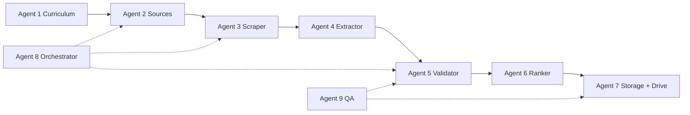

# Grammar Corpus Scraper — Reality Check & Multi-Agent Plan

## 1. Is this project realistic?

**Short answer: yes, as a phased system — not as “scrape literally everything on the internet in one shot.”**

### What is realistic

| Goal | Realistic? | Notes |
|------|------------|-------|
| Ask for one grammar topic → scrape → validate → save | **Yes** | MVP already exists (`exercise-scraper` CLI/API/UI) |
| Validator that rejects junk and keeps best tasks | **Yes** | Needs upgrade (current validator is too weak; see sample output) |
| Per-topic folders on disk | **Yes** | Already partially done (`output/past-simple_YYYY-MM-DD/`) |
| Sync to **Google Drive** (separate folder per topic) | **Yes** | OAuth + Drive API; not built yet |
| Cover **30–80 grammar topics** (A1–C2) with hundreds of exercises each | **Yes** | Over multiple crawl waves, with domain rules |
| Dictionary words / definitions alongside grammar | **Partially** | Separate pipeline; different sites and legal constraints |
| 100% of all exercises on the internet | **No** | Paywalls, JS quizzes, PDFs, copyright, robots.txt |

### Evidence from current MVP

A real crawl for `Past Simple` can return low-quality “exercises” such as menu text or page labels. That means:

- scraping works
- extraction heuristics are not enough yet
- validator must become **grammar-aware**, not only length/keyword based

**Conclusion:** Building a real production scraper is justified. Scope must be **curriculum-driven** (known grammar list + known sources), not “whole internet.”

---

## 2. Target system (end state)

```
User: "Past Simple" / "Present Perfect" / grammar class ID
        │
        ▼
┌───────────────────┐
│  Orchestrator     │  job queue, retries, rate limits
└─────────┬─────────┘
          │
    ┌─────┴─────┬─────────────┬──────────────┐
    ▼           ▼             ▼              ▼
 Discovery   Scraper      Extractor      Dictionary
 (search)    (Scrapling)  (rules+LLM)    (optional)
    │           │             │              │
    └─────┬─────┴─────────────┴──────────────┘
          ▼
┌───────────────────┐
│ Grammar Validator │  topic-specific rules + generic quality gate
└─────────┬─────────┘
          ▼
┌───────────────────┐
│ Ranker + Dedup    │  top N per topic (e.g. 3 or 50)
└─────────┬─────────┘
          ▼
┌───────────────────┐
│ Storage           │  local folders + Google Drive sync
└───────────────────┘
```

### Folder layout (local + Drive mirror)

```
grammar-corpus/
├── grammar/
│   ├── A2/
│   │   ├── past-simple/
│   │   │   ├── exercises.json
│   │   │   ├── exercises_top3.json
│   │   │   ├── validation_report.json
│   │   │   ├── sources.json
│   │   │   └── pages/
│   │   └── present-perfect/
│   └── B1/
│       └── conditionals/
├── dictionary/
│   ├── en-pl/
│   └── by-level/
└── manifests/
    └── crawl_2026-07-10.json
```

Same structure uploaded to Google Drive root folder, e.g. `GrammarCorpus/`.

---

## 3. Grammar curriculum (scope definition)

Before “all grammar classes,” define a **taxonomy file** — single source of truth for agents.

```yaml
# config/grammar_taxonomy.yaml
topics:
  - id: past-simple
    level: A2
    en: ["Past Simple", "Simple Past"]
    pl: ["czas Past Simple", "czas przeszły prosty"]
    validators: ["past_simple"]
    exercise_types: [fill_blank, rewrite, multiple_choice]

  - id: present-perfect
    level: B1
    en: ["Present Perfect"]
    pl: ["Present Perfect", "czas present perfect"]
    validators: ["present_perfect"]
```

Suggested first wave: **20 topics** (tenses + articles + modals).  
Second wave: **+30 topics** (conditionals, passive, reported speech).  
Dictionary: parallel track, not mixed into grammar spider initially.

---

## 4. Validator design (critical upgrade)

### Layer A — Generic quality (exists today)

`exercise_scraper/validation/quality.py` — length, noise, shape.

### Layer B — Grammar-topic validators (to build)

One small Python module per topic, e.g.:

```
validation/
├── quality.py          # generic
├── registry.py         # topic_id → validator list
└── topics/
    ├── past_simple.py
    ├── present_perfect.py
    └── articles.py
```

Example `past_simple.py` checks:

- sentence contains a verb slot `(go)` / `___`
- optional: past time marker (`yesterday`, `last week`, `ago`)
- rejects navigation/menu strings
- optional: expected past form in answer key

### Layer C — LLM validator (optional, controlled)

Only for ambiguous candidates after Layer B.  
Input: exercise text + topic + level.  
Output: `{ "is_valid": true, "score": 0.92, "reason": "..." }`  
Budget cap per crawl.

### Layer D — Auto-generated validator scripts

For each new topic, Orchestrator can emit a starter validator from taxonomy metadata (template), then human or QA agent refines.

**Pipeline rule:** scrape many → validate all → **save only passed** → rank → keep top N.

---

## 5. Google Drive integration

Assumption: **Google Drive** (not “whole Google”) for folder sync.

| Piece | Technology |
|-------|------------|
| Auth | Google Cloud project + OAuth desktop or service account |
| API | `google-api-python-client` |
| Sync | After local write, upload `grammar/<level>/<topic>/` |
| Config | `GOOGLE_DRIVE_ROOT_FOLDER_ID`, credentials JSON |

Flow:

1. Crawl finishes locally
2. Validator writes `validation_report.json`
3. Drive Sync Agent uploads folder
4. Manifest updated with `drive_folder_url`

**Not in scope for v1:** real-time Sheets editing (can add export to Sheet later).

---

## 6. Multi-agent breakdown

Use separate agents (Cursor Cloud / subagents) with clear contracts.

### Agent 1 — Curriculum Architect

**Owns:** `config/grammar_taxonomy.yaml`, levels A1–C2, PL/EN query templates  
**Delivers:** topic list, validator IDs, folder naming rules  
**Exit criteria:** 20 topics documented with en/pl search phrases

### Agent 2 — Source Discovery

**Owns:** search providers, seed URLs per topic, domain allowlist  
**Delivers:** `sources/<topic_id>.json` with ranked URLs  
**Uses:** SerpAPI/DuckDuckGo + manual seeds (perfect-english-grammar.com, etc.)

### Agent 3 — Scraper Engine

**Owns:** Scrapling spiders, rate limits, robots.txt, retries  
**Delivers:** raw HTML archive + crawl stats per URL  
**Extends:** current `ExerciseSpider`

### Agent 4 — Extractor

**Owns:** `domain_rules.yaml`, per-site CSS selectors, PDF extractor  
**Delivers:** raw `exercises_raw.json` per topic  
**Note:** biggest quality lever after scraping

### Agent 5 — Grammar Validator

**Owns:** `validation/topics/*`, registry, validation reports  
**Delivers:** `exercises_validated.json`, rejected list with reasons  
**Fixes:** current false positives (menu text marked as exercises)

### Agent 6 — Ranker & Dedup

**Owns:** top-N selection, cross-source dedup, source diversity  
**Delivers:** `exercises_top3.json` or configurable N

### Agent 7 — Storage & Drive Publisher

**Owns:** folder layout, SQLite/JSON index, Google Drive sync  
**Delivers:** mirrored Drive tree + manifest URLs

### Agent 8 — Orchestrator

**Owns:** job API, scheduling, “scrape topic X” command, agent handoffs  
**Delivers:** one endpoint: `POST /api/corpus/topics/{id}/run`  
**Extends:** current FastAPI `backend/`

### Agent 9 — QA & Monitoring

**Owns:** golden fixtures, regression tests, crawl dashboards  
**Delivers:** weekly quality report (% valid, top domains, failure reasons)

---

## 7. Phased roadmap

### Phase 0 — Stabilize MVP (current repo)

- [x] CLI + API + UI
- [x] Basic validator + top 3
- [ ] Fix validator false positives
- [ ] Configurable `top_n` (not hardcoded 3)
- [ ] Save rejected exercises for debugging

### Phase 1 — Curriculum + single-topic pipeline

- [ ] `grammar_taxonomy.yaml` (20 topics)
- [ ] Folder layout `grammar/<level>/<topic>/`
- [ ] Topic-specific validator for **Past Simple** and **Present Perfect**
- [ ] End-to-end: one topic → validate → folder → report

### Phase 2 — Batch corpus builder

- [ ] Orchestrator runs all topics in taxonomy
- [ ] Domain rules for top 5 EN + 3 PL sites
- [ ] Dedup across crawls
- [ ] SQLite index: topic, text hash, source, validation_score

### Phase 3 — Google Drive sync

- [ ] OAuth setup doc
- [ ] Drive Sync Agent uploads per-topic folders
- [ ] Manifest includes Drive links

### Phase 4 — Dictionary track (parallel)

- [ ] Separate `dictionary/` taxonomy (CEFR word lists)
- [ ] Scrape definitions from allowed sources (or import open datasets)
- [ ] Do not mix with grammar spider initially

### Phase 5 — Scale & quality

- [ ] LLM validator for edge cases only
- [ ] PDF exercise extraction
- [ ] Export Anki / Google Sheets
- [ ] Expand to 50+ grammar topics

---

## 8. Dictionary: separate or combined?

| Approach | Recommendation |
|----------|----------------|
| Same spider as grammar | **Avoid** — different HTML, licensing, structure |
| Separate `dictionary-scraper` package | **Yes** — shared Orchestrator + Storage only |
| Data source | Prefer open word lists + selective scraping |

---

## 9. Legal & operational constraints

- Respect `robots.txt` and site ToS
- Rate limit: ≥1.5s between requests per domain
- Store `source_url` + `scraped_at` on every item
- Educational / personal use; no republication without rights
- Some sites block cloud IPs — may need residential proxy (Scrapling StealthyFetcher)

---

## 10. Suggested agent execution order



**Parallelizable:** Agent 1 + Agent 9 (fixtures) early; Agent 7 Drive auth in parallel with Agent 4.

---

## 11. Success metrics

| Metric | Phase 1 target | Phase 3 target |
|--------|----------------|----------------|
| Valid exercise rate | ≥60% of raw extractions | ≥75% |
| Junk in top 3 | 0 menu/nav strings | 0 |
| Topics covered | 20 | 50+ |
| Avg exercises per topic | 30+ validated | 100+ |
| Drive sync success | n/a | 99% uploads |

---

## 12. Immediate next steps (recommended)

1. **Agent 1** — create `grammar_taxonomy.yaml` with 20 topics  
2. **Agent 5** — rewrite validator; add `past_simple.py` topic validator  
3. **Agent 4** — add `domain_rules.yaml` for agendaweb.org, test-english.com, perfect-english-grammar.com  
4. **Agent 8** — extend API: `POST /api/corpus/topics/{id}/run`  
5. **Agent 7** — Google Drive OAuth spike (upload one folder)  

---

## 13. What you already have in this repo

| Component | Path | Status |
|-----------|------|--------|
| Scraper engine | `exercise_scraper/crawl/spider.py` | Working |
| Search | `exercise_scraper/search/` | Working |
| Generic validator | `exercise_scraper/validation/quality.py` | Needs upgrade |
| Top-N selection | `select_top_exercises()` | Working |
| CLI | `exercise_scraper/cli.py` | Working |
| API + jobs | `backend/` | Working |
| Web UI | `frontend/` | Working |
| Validate script | `scripts/validate_exercises.py` | Working |

**Gap:** topic-aware grammar validators, taxonomy, corpus folder standard, Google Drive, batch orchestration across all classes.

---

## 14. Open question

Confirm integration target:

- **Google Drive** (folders per grammar topic) — assumed in this plan  
- **Google Sheets** (tabular export) — optional add-on  
- Something else by “tryf.google”?

Once confirmed, Agent 7 can start OAuth and folder sync design.
